# Readme

This project is to build a model that predicts an Airline has a flight departure delay. The model will represent the Airlines American Airlines (AA), United Airlines (UA), and American Eagle Airlines (MQ).

The model helps a customer determine if their flight will be delayed so they might plan to reschedule. 

The models used are Decision Tree, Random Forest, and XGBoost. Each model has a baseline, then applied random search, then SMOTE. So we can observe each model's  predictions.

#### Model's Features and Parameters 

Departure delay will be defined as any delay more than 15 minutes. 

The features used to predict delay:
 - Arrival Time of the flight
 - Distance of the Flight 
 - Day of Month
 - Month
 - Day of Week 
 - Destination:
     - Dallas Fort-Worth
     - Denver
     - Orlando
     - Los Angeles 
     - Atlanta

### Feature Importance

##### Decision Tree

I will use a decision tree model since the data possibly has varying scenarios that could lead to a delay. Decision tree model will determine multiple possible scenarios to predict a flights delay.

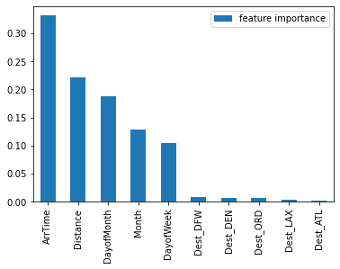

The next model is random forest. This model is creating multiple decision trees in order to find the best prediciton model.

##### Random Forest

Random Forest Arrival time and Distance effeect the model more than decision tree...

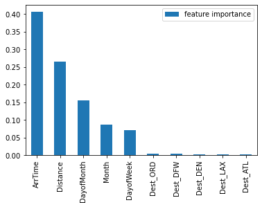

Again, Arrival Time and distance are weighted more in this model. 

##### XGBoost

XGBoost reduces variance and bias when creating the prediction model and resists overfitting.

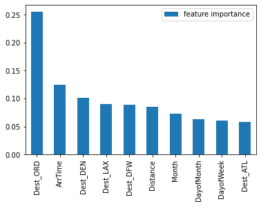

XGBoost weighs each feature more evenly, particularly the destinations weighing more than in previous models. 

### Baseline Models

#### Decision Tree 

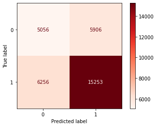

                   precision recall f1-score   support

       On Time       0.45      0.46      0.45     10962
       Delay         0.72      0.71      0.71     21509

    accuracy                           0.63     32471
    macro avg       0.58      0.59      0.58     32471
    weighted avg    0.63      0.63      0.63     32471

The baseline decision tree model captures the delay, 72% of the predicted delays, are actually delays. And of the delays, 71% are predicted.

#### Random Forest

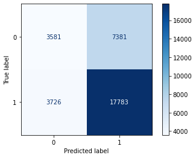

                   precision recall f1-score   support

       On Time       0.49      0.33      0.39     10962
       Delay         0.71      0.83      0.76     21509

    accuracy                           0.66     32471
    macro avg       0.60      0.58      0.58     32471
    weighted avg    0.63      0.66      0.64     32471

The baseline decision tree model captures the dela,y 71% of the predicted delays, are actually delays. And of the delays, 83% are predicted. The model was able to increase its recall because of its use of many decision trees to predict, therefore able to find more scenarios predicting delay.

##### XGBoost

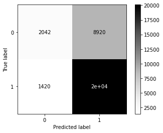

                   precision recall f1-score   support

       On Time       0.59      0.19      0.28     10962
       Delay         0.69      0.93      0.80     21509

    accuracy                           0.68     32471
    macro avg       0.64      0.56      0.54     32471
    weighted avg    0.66      0.68      0.62     32471

The baseline decision tree model captures the dela,y 69% of the predicted delays, are actually delays. And of the delays, 93% are predicted.

## Random Search

Random Search will provide a more detailed observation of the data. It will provide and test our models with multiple hyperparameters so we are able to experiment with improving our models. 

##### Decision Tree

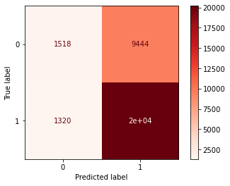

                  precision  recall    f1-score   support

     On Time       0.53      0.14      0.22     10962
       Delay       0.68      0.94      0.79     21509

    accuracy                           0.67     32471
    macro avg       0.61      0.54      0.50     32471
    weighted avg    0.63      0.67      0.60     32471

##### Random Forest

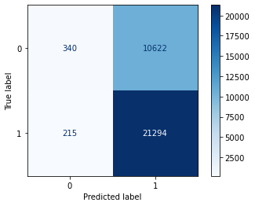

                  precision  recall    f1-score support

     On Time       0.61      0.15      0.23     10962
       Delay       0.67      0.99      0.80     21509

    accuracy                           0.67     32471
    macro avg       0.64      0.51      0.43     32471
    weighted avg    0.65      0.67      0.55     32471

##### XGBoost

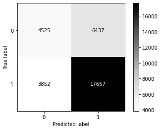

                   precision recall    f1-score   support

     On Time       0.54      0.41      0.47     10962
       Delay       0.73      0.82      0.77     21509

    accuracy                           0.68     32471
    macro avg       0.64      0.62      0.62     32471
    weighted avg    0.67      0.68      0.67     32471

For our decision tree and random forest recall increased from our baseline and XGBoost generally stayed the same.

## SMOTE

##### Decision Tree

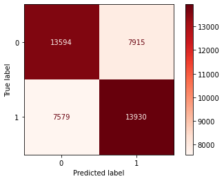

                  precision  recall  f1-score   support

     On Time       0.64      0.63      0.64     21509
       Delay       0.64      0.65      0.64     21509

    accuracy                           0.64     43018
    macro avg       0.64      0.64      0.64     43018
    weighted avg    0.64      0.64      0.64     43018

##### Random Forest

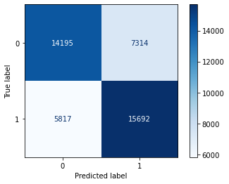

                  precision  recall  f1-score   support

     On Time       0.71      0.66      0.68     21509
       Delay       0.68      0.73      0.71     21509

    accuracy                           0.69     43018
    macro avg       0.70      0.69      0.69     43018
    weighted avg    0.70      0.69      0.69     43018

##### XGBoost

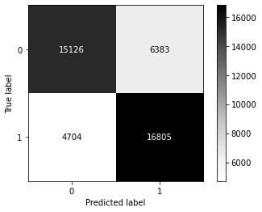

                  precision  recall  f1-score   support

     On Time       0.76      0.70      0.73     21509
       Delay       0.72      0.78      0.75     21509

    accuracy                           0.74     43018
    macro avg       0.74      0.74      0.74     43018
    weighted avg    0.74      0.74      0.74     43018

With SMOTE our On Time predictions have increased and it closely reflects the Delay's prediciton and recall. 

A XGBoost model with random searched parameters and SMOTE classification is the best model for predicting flight delays. 
